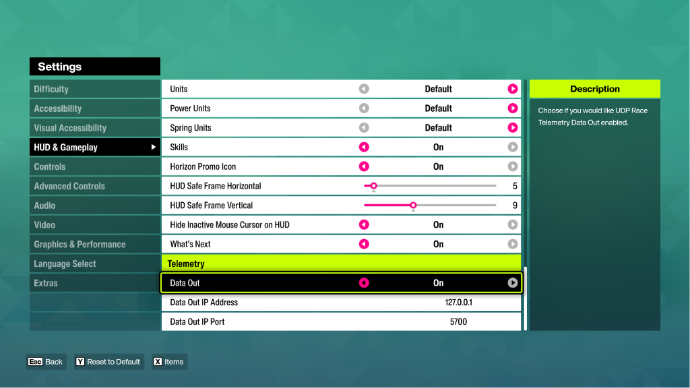

# 🏎️ Forza Horizon 6 Crash Detector

   <a href="https://www.buymeacoffee.com/markyip"></a>

Haiyaa! Did you just take that 180-degree turn at 200 mph and wrap your multi-million dollar hypercar around a virtual tree? Uncle Roger is not angry. Uncle Roger is just disappointed. This is a simple, zero-dependency command-line Python application designed to run on Windows. It listens to the live UDP telemetry broadcast by Forza Horizon 6 (and other recent Forza titles) and automatically plays a local audio clip when a crash is detected.

We use a combined G-force spike and sudden speed-drop algorithm—advanced technology to sense your total lack of driving talent.

---

## 🚫 Prerequisites

Before you start embarrassing yourself, make sure you have:

- **Operating System:** Windows 10 or 11 (uses native Windows APIs. Good job, Bill Gates).
- **Python:** Python 3.6 or newer installed and added to your system's Environment Variables (PATH). If you don't know what PATH is, haiyaa, go ask your smart cousin.
- **FFmpeg (Optional):** Required only if you intend to convert sad MP3 files to glorious WAV using the built-in converter script (`convert_mp3_to_wav.py`).
- **Forza Horizon 6:** If you don't actually own the game, why are you downloading this? Haiyaa! You cannot crash your car if you don't have a car! Go buy the game first, then come back and let Uncle Roger judge your driving. Don't be cheap, support the developers!

---

## 1. Setup Audio File

Create a folder named **`sounds`** in the same directory as the script.

### Customizing Your Disappointment

- **Custom Audio Clips:** You can place your own custom `.wav` files inside the `sounds` folder. Feel free to add Uncle Roger yelling _Haiyaa!_ or your mom sighing in disappointment.
- **Randomized Playback:** If you place multiple `.wav` files inside the `sounds` folder, the app will automatically select and play a random clip every time you crash! Every mistake a new flavor of sadness!

_(Note: Windows `winsound` API natively requires `.wav` files. You can convert any `.mp3` to `.wav` using the built-in batch launcher tools. There is a hardcoded playback limit of **5 seconds** per alert. Nobody wants to hear you fail for longer than 5 seconds)._

---

## 2. Configure Forza Horizon 6 (Make Game Talk to Script)

In FH6, open your settings menu. Don't mess this up, it's easier than making fried rice:

1. Go to **Settings** -> **HUD and Gameplay**
2. Set **Data Out**: `On`
3. Set **Data Out IP Address**: `127.0.0.1`
4. Set **Data Out IP Port**: `5700`



_(Use `127.0.0.1` when the app runs on the same PC as the game)._

---

## 3. Running the Application

The easiest way to run the application is by using the pre-configured Windows batch file. Even your niece and nephew can do it.

### Option A: Using the Launcher (Recommended)

1. Double-click the **`run.bat`** file in the application directory.
2. Select from the interactive menu:
   - **`1`**: Start the Crash Detector with default settings (port `5700`, G-force threshold `15.0 G`, cooldown `3s`).
   - **`2`**: Show command-line help options.
   - **`3`**: Exit and go buy an MSG packet instead.

### Option B: Command Line (For Tech Experts)

Open Command Prompt (`cmd`) or PowerShell in the directory containing the script and run:

```bash
python crash_detector.py
```

### Advanced Tweak Options

You can configure how much the app judges you using command-line arguments:

- `--port`: Change the UDP port to listen on (e.g., `--port 5700`).
- `--threshold`: Adjust the trigger G-force threshold (default: `15.0`). If you are a truly terrible driver, make this number higher so it only triggers when you total the car.
- `--audio`: Specify a custom path to your sound file (e.g., `--audio custom_alert.wav`).
- `--cooldown`: Seconds to wait before allowing another sound to play (default: `3.0`). Gives you 3 seconds to regret your life choices before the next crash.
- `--axis`: Limit monitoring to a specific axis (`all` for 3D G-force, `long` for forward-backward deceleration, `lat` for side-to-side drift impacts).

Example:

```bash
python crash_detector.py --threshold 45.0 --cooldown 15.0 --axis long
```

---

## 4. Troubleshooting Local Loopback (Why is it not working? Haiyaa!)

If you run the game and the script on the same Windows PC, and you are using the **Microsoft Store or Xbox Game Pass** version of the game, Windows security isolation blocks Microsoft Store Apps from sending UDP traffic to localhost (`127.0.0.1`).

Don't cry. Here is how to fix:

### Solution (Choose one):

1. **Steam version:** If you own the Steam version of the game, it is a normal desktop app and does not have this restriction. It will work immediately. Fuiyoh!
2. **Exempt the Game (AppContainer Loopback Exemption):**
   You can exempt the game using Windows command line.
   - Open PowerShell as **Administrator** (Right-click -> Run as Administrator).
   - For Forza Horizon 5, run:
     ```powershell
     CheckNetIsolation.exe LoopbackExempt -a -n="Microsoft.624F8CE97B47E_8wekyb3d8bbwe"
     ```
   - For Forza Horizon 6 (Windows Store / Game Pass version), run:
     ```powershell
     CheckNetIsolation.exe LoopbackExempt -a -n="Microsoft.ForteBaseGame_8wekyb3d8bbwe"
     ```
3. **Use a graphical tool:** Download a free loopback exemption tool such as **"AppContainer Loopback Exemption Utility"** (e.g., from Telerik or GitHub), find the game in the list, check the box to exempt it, and click Save.

---

## ⚠️ Disclaimer & Copyright Notice

Please Read, Very Important: This project is created strictly for entertainment, parodic, and educational purposes.

- **For Streamers & Content Creators:** If you use this application on a public stream, YouTube video, or any public platform, please be aware of copyright laws regarding any custom audio clips you choose to play. You use this software and your custom sound clips at your own risk.
- **IP Owners:** We respect intellectual property rights. If you are a copyright holder and believe any part of this repository infringes upon your work, please contact us, and we are completely willing to modify or remove the application immediately. No drama, only peace.
